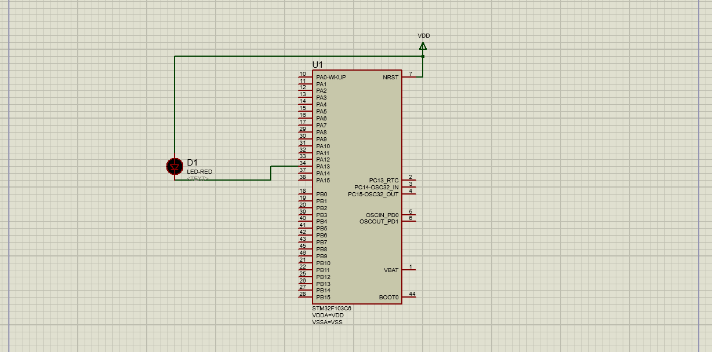

# Lab 1 : Toggle LED 

## STM32F103CX

objectives:

1-write a [Platform_Types.h](./code/inc/Platform_Types.h) file that include my own typpdef of variables and standard  

4-learn about arm cross toolchain

3-use GPIO Port A13 to toggle LED , the objectives was to learn how to use C and Pointers to accses a memory mapped periphrals register in an efficient way as seen in this [file](./code/src/main.c) 

4-using STM32CUBE IDE for coding and compiling of project and use the .hex file for simulation using protus 

output:
 