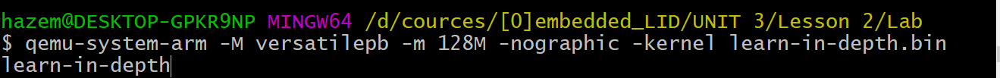

# Lab 2 : The compilation and buiding process 

## Board versatilerp ,ARM926EJ-S Core

Create a baremetal Software to send a “learn-in-depth” using UART 

objectives:

1-using arm-none-eabi-gcc to compile .c files and create object files .o without linking

2-Investagte object files .o sections using objdump

3-Write the [stratup file](./startup.s)

4-Write a [linker script](./linker_script.ld) 

5-complete listing of all code and data adresses [.map file](./map_file.map) 

6-Ivestigate symbols for each object using nm [symbols](./object_files.txt)

7-simulate using qemu 

output

