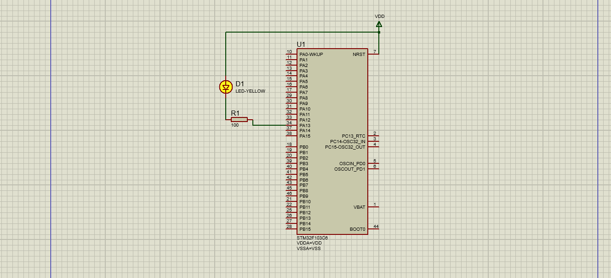

# Lab 3 : Makefile and startup.c file 

create a [SW](./Code/main.c) to toggle a LED using board STM32F103CX while automating the whole building process without an IDE  

## Objectives 

1 - write the [linker script](./Code/linker_script.ld) to include the FLASH and SRAM and adjust memmory layout and boundries and stack 

2 - write the [startup](./Code/startup.c) file in c rather than in asm and copy the data section to the SRAM from FLAsH and define the default interupts handlers 

3 - write a [Makefile](./Code/Makefile) to automate the build and make it generic for reuse in other projects using Make spceial variables 

## Simulation

