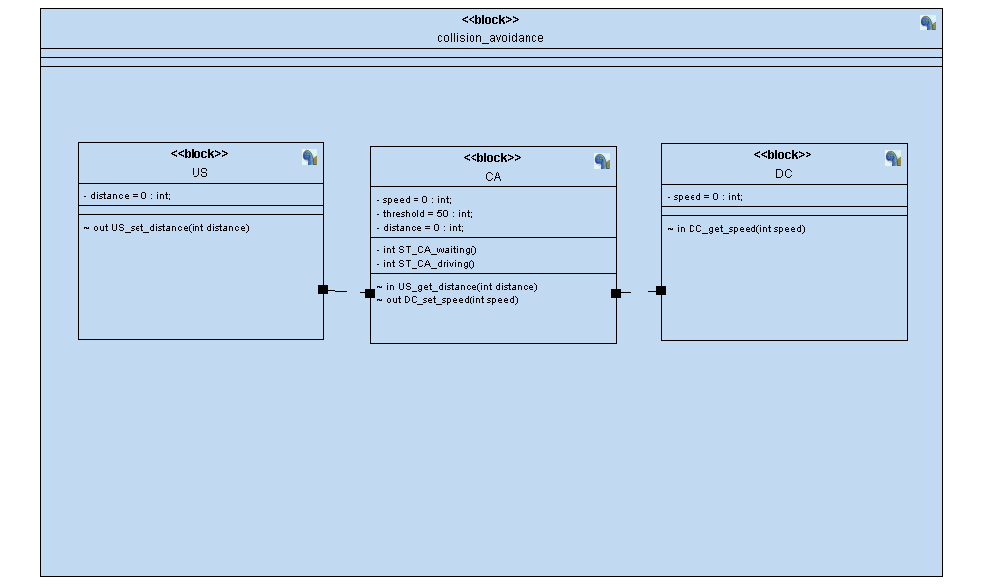
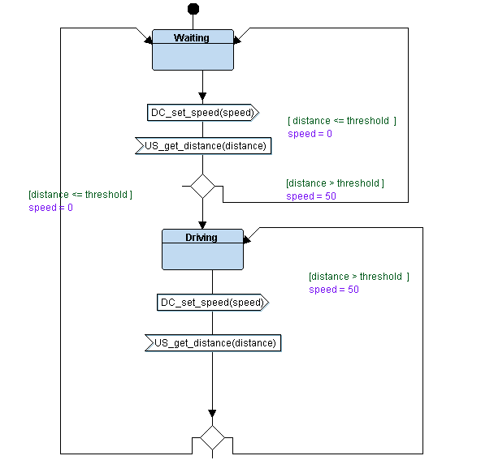
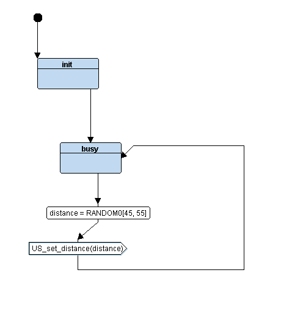
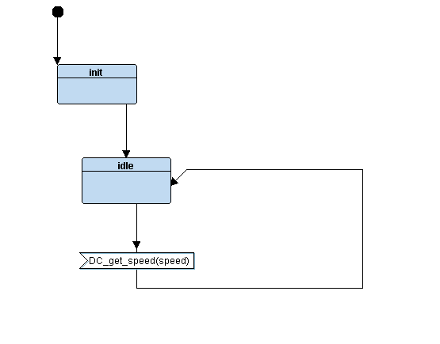
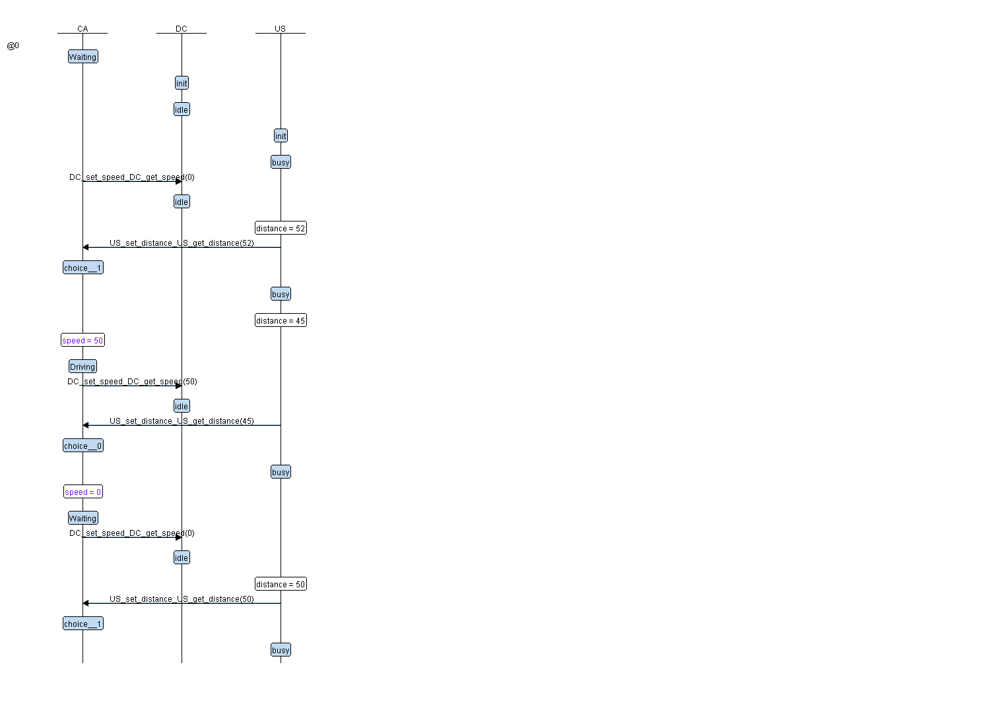

# Collision Avoidance Report

using 3 modules and logic state machine design to simulate the algorithim where each module consist of states and transtions 

## Objective 

measure distance using an ultrasonic and if close to the obstcle infront then stop motor

## Purpose 
is to learn about diffrient diagrams and methods to represent the apllication in state machine format 

1 - CA (the logic for the program)
 
2 - US (to control ultrasonic to measure distance)
 
3 - DC (to control motor speed)

## CA Module State

## US Module State

## DC Module State

### the sequence diagram of the operation 

