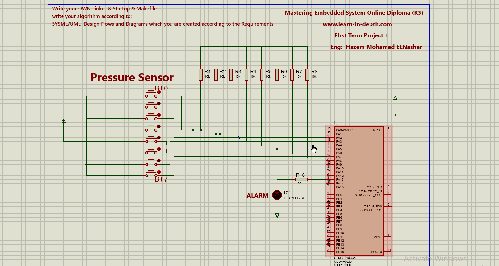

# Pressure Controller 

objective: 
 
Get reading of Pressure from a sensor in a airplane crew cabin if pressure exceeds 20 bars in the cabin then start an alarm using STM32 ECU
 
using State Machine Archticture to design our project and varoius UML Diagrams to describe the project and implmenting from scratch a startup.c file a makefile and a linker script file , and using Protus for simulation 
 
 

## Project Simulation 

